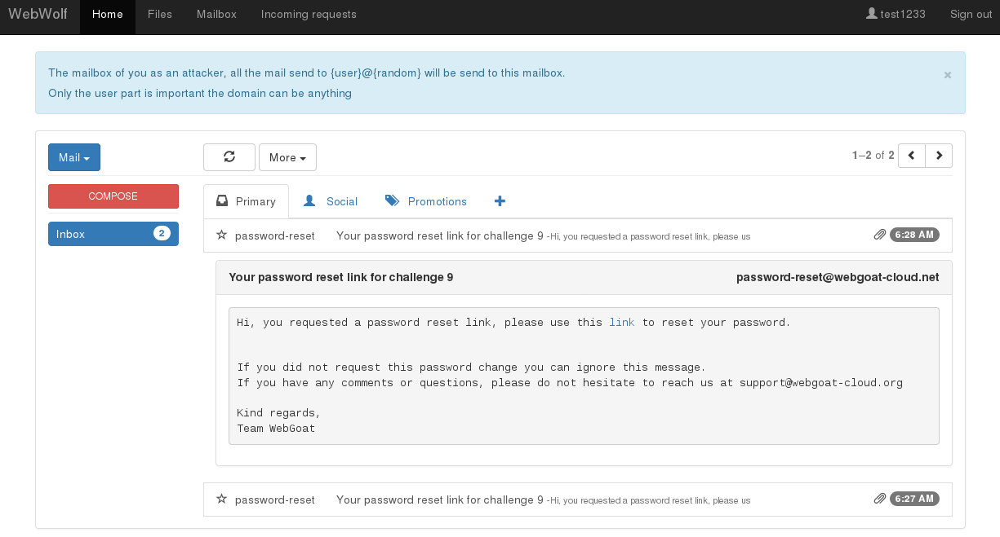
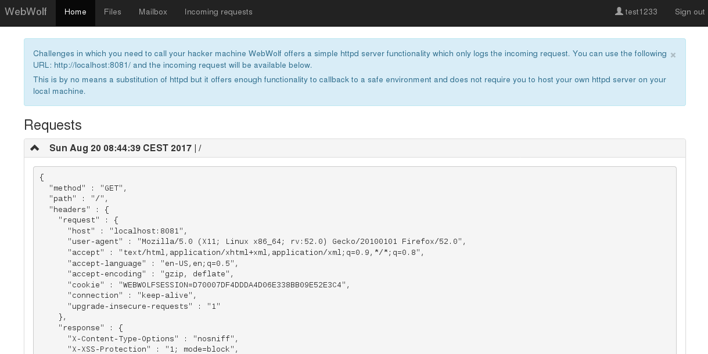

<p> 

<br/>
</p>


## WebWolf the small helper

WebWolf is a separate web application which simulates an attackers machine. It makes it possible for us to
make a clear distinction between what takes place on the attacked website and the actions you need to do as
an "attacker". WebWolf was introduced after a couple of workshops where we received feedback that there
was no clear distinction between what was part of the "attackers" role and what was part of the "users" role on the
website. The following items are supported in WebWolf:

### Host a file

Upload a file needed to be downloaded during an assignment


### E-mail client

WebWolf serves a mail client with which we can easily simulate sending an e-mail.



### Landing page for incoming requests

WebWolf can serve as a landing page to which you can make a call from inside an assignment, giving you as the attacker
information about the complete request. Think of it as a very simple form of `netcat`.




## Running

WebWolf runs as a separate web application. If you are using the Docker-compose file you can just point your browser 
`http://localhost:9090/WebWolf` to open WebWolf. It will 

### 1. Standalone

If you want to use the standalone version, you will need to download the jar file and start it:

```Shell
java -jar webwolf-<<version>>.jar [--server.port=9090] [--server.address=localhost]
```

By default WebWolf starts on port 9090 with `--server.port` you can specify a different port. With `server.address` you
can bind it to a different address (default localhost)


### 2. Run using Docker

```Shell
docker pull webgoat/webwolf
docker run -p 9090:9090 -t webgoat/webwolf```


Note: if you start WebGoat as standalone application you need to start WebWolf as standalone application as well.
